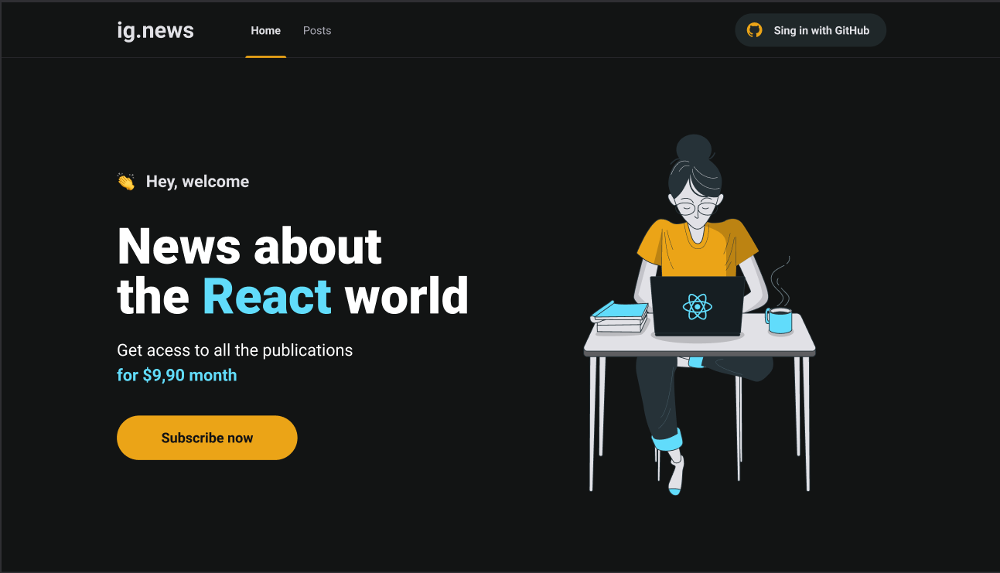

<h1 align="center">
  ig.news
</h1>

  <a href="#-layout">Layout</a>&nbsp;&nbsp;&nbsp;|&nbsp;&nbsp;&nbsp;
  <a href="#-projeto">Projeto</a>&nbsp;&nbsp;&nbsp;|&nbsp;&nbsp;&nbsp;
  <a href="#-tecnologias">Tecnologias</a>&nbsp;&nbsp;&nbsp;|&nbsp;&nbsp;&nbsp;    
  <a href="#memo-licença">Licença</a>

 

  

## 💻 Projeto

O ig.news é uma aplicação de assinatura de posts. 

A aplicação está sendo desenvolvida no módulo de Fundamentos do Next.js, da trilha de Reacjs, do curso Ignite da Rocketseat. 

## 🚀 Tecnologias

Esse projeto foi desenvolvido com as seguintes tecnologias:

- Reactjs
- Nextjs
- Typescript
- Sass

## :memo: Licença

Esse projeto está sob a licença MIT. Veja o arquivo [LICENSE](LICENSE.md) para mais detalhes.

---
